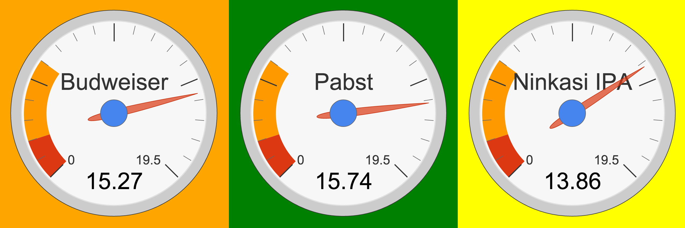
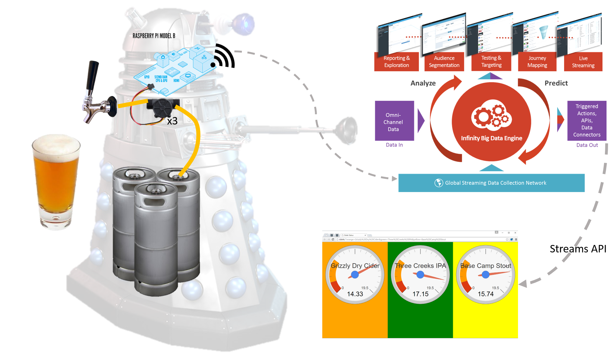

dalek-status
==========




Overview
--------

An embedded flow state tracking system that leverages [Webtrends Streams™](http://www.webtrends.com/products/streams/).




Requirements
------------

[nodejs](https://nodejs.org/) >= v0.10.x


Installation
-------------

```
npm install
```

Client/Server Usage
-----


**running in embedded mode** ([example](run_example.sh))

* Collect from local sensors, broadcast to [SCS](http://scs.webtrends.com/), and display dalek status at [http://localhost:3000/](http://localhost:3000/)

**running in streams client app mode** ([example](run_app_example.sh))

* Collect stream from [SAPI](http://sapi.webtrends.com/) and display dalek status at [http://localhost:3001/](http://localhost:3001/)

* *You will need to provide your own accountId, oauth clientId & secret.*


Setting Stream titles
---------------------

* Each stream is marked a color associated with the flow sensor that it is represents.

* Currently:orange, green, yellow [?orange=Budweiser&green=Pabst&yellow=Ninkasi%20IPA](http://localhost:3000/?orange=Budweiser&green=Pabst&yellow=Ninkasi%20IPA)

```
http://<servername>:3000/?orange=Budweiser&green=Pabst&yellow=Ninkasi%20IPA
```


